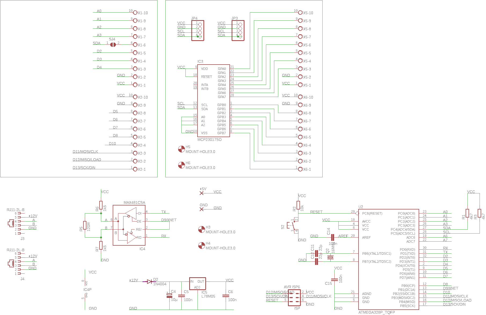
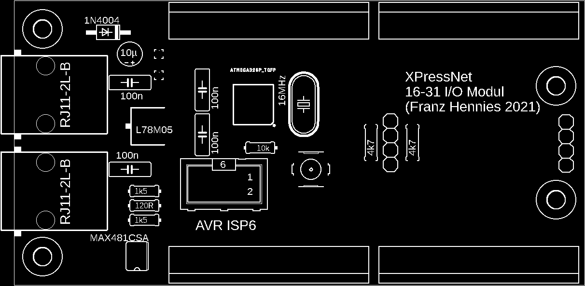
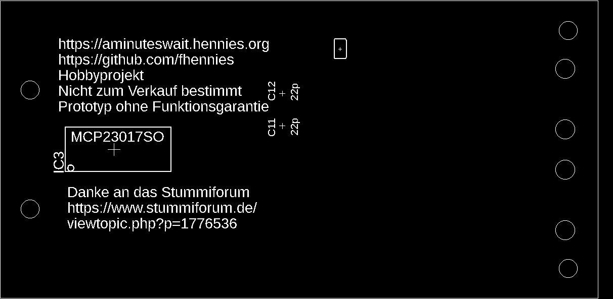
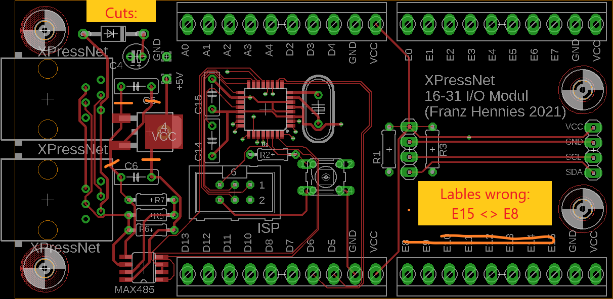
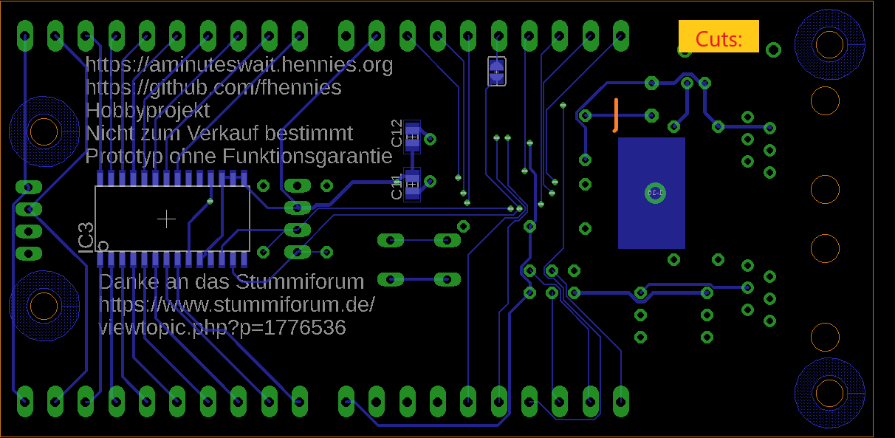
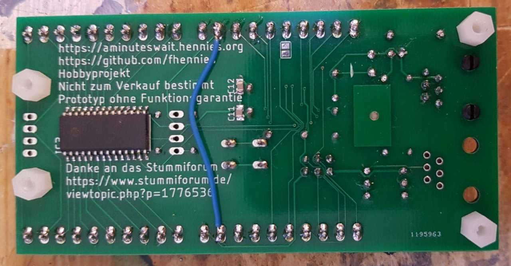

Mein erstes PCB design enthält leider einen dummen Fehler, deshalb veröffentliche ich es hier nicht. 
Es müssen einige Leiterbahnen auf Vorder- und Rückseite durchtrennt werden und ein paar neue Brücken gemacht werden. 

#### Schaltplan:                                      

#### Bauteilewerte:
                                    
                                                 

#### PCB Vorderseite mit durchtrennten Bahnen:   

#### PCB Rückseite mit durchtrennten Bahnen:     

#### Foto PCB Vorderseite mit Brücken:                

#### Foto PCB Rückseite mit Brücken:                  

#### BOM im Reichelt-Format: XPressIO.csv

    RAD 10/35;1
    Z5U-2,5 100N;4
    NPO-G0805 22P;2
    1N 4004;1
    MCP23017-E/SO;1
    MAX 485 CSA;1
    L78M05ABDT STM;1
    WSL 6G;1
    MEBP 6-6S;2
    16,0000-HC49U-S;1
    1/4W 4,7k;2
    1/4W 10k;1
    1/4W 120;1
    1/4W 1,5k;2
    TASTER 3301;1
    ATMEGA 328P-AU;1
    AKL 059-10;4
