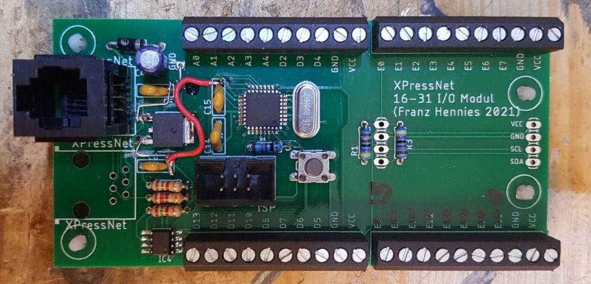

Mein erstes PCB design enthält leider einen dummen Fehler, deshalb veröffentliche ich es hier nicht. 
Es müssen einige Leiterbahnen auf Vorder- und Rückseite durchtrennt werden und ein paar neue Brücken gemacht werden. 

#### Schaltplan:                                      

#### Bauteilewerte:
                                    
                                                 

#### Foto PCB Vorderseite mit durchtrennten Bahnen:   

#### Foto PCB Rückseite mit durchtrennten Bahnen:     

#### Foto PCB Vorderseite mit Brücken:                

#### Foto PCB Rückseite mit Brücken:                  
